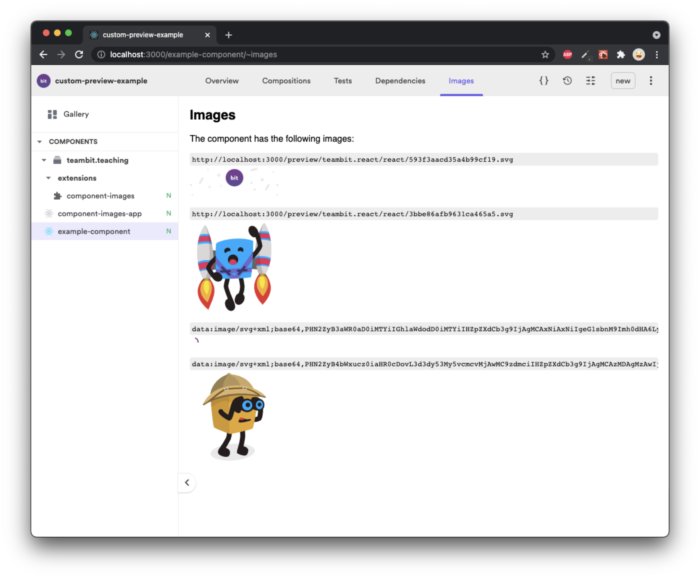

# custom-preview-example

This project showcases an `aspect` (bit extension) that presents all the images in a component.

# What's included

It does 3 things:

1. Add a tab in the component page with an iframe to the preview. (`component-images.ui.runtime.tsx`)
1. Render the _images preview_ inside the iframe (`component-images.preview.runtime.ts`)
1. Bundles the images as their own _preview target_. (`component-images.main.runtime.ts`).
   this also bundles the preview template (`component-images-app.tsx`)

# setup

- `bit install`
- `bit compile`
- make sure there are no errors using `bit status`
- `bit start` (add `--dev` when editing the custom extension)
